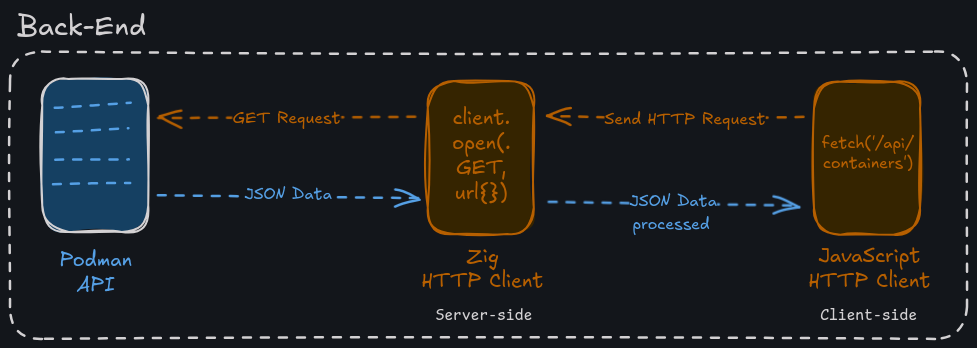
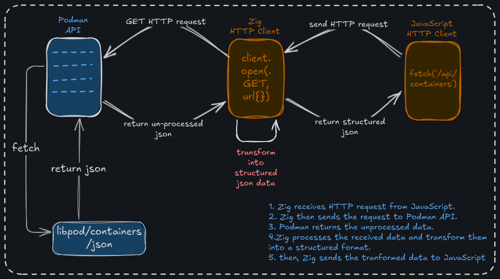

# fcm
Fedora Container Manager

1. **Start the Podman API Server**:

``` sh
podman system service tcp:localhost:8080 --time=0 &
```
> This starts the API service in background(&) under the port 8080

- In order to communicate with Podman, we need use the Podman's RESTful API to access the container informations.
- The above command starts the server, which enables to communicate with Podman using http request to send & receive data.
- This is the first and foremost step complete for API communications.

2. [**Send HTTP Request using Ziglang**](./backend/routes/README.md)

## Workflow

### Back-end: Overview

### Back-end: Explained

1. When the user clicks any of the sections, JavaScript sends a **GET request** to the Zig application.
2. Zig **receives the HTTP request from JavaScript** and send a **GET Request** to the **Podman API endpoint**.
3. Podman will **fetches & returns the JSON data to Zig** from API endpoint. 
4. Zig transforms the unstructured JSON data to structured data and sends it to JavaScript.

### Front-end

